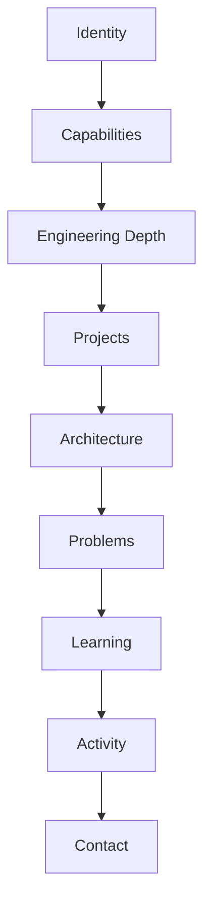

<div align="center">


</div>

<table align="center">
<tr><td>

```text
┌ SYSTEM STATUS ─────────────────────────────────┐
  ROLE          CSE STUDENT / BUILDER
  FOCUS         AI · WEB · DATA · SECURITY
  STATUS        BUILDING
  LOCATION      INDIA
  CURRENT       ENGINEERING MODE
└─────────────────────────────────────────────────┘
```

</td></tr>
</table>

<div align="center">

<sub>`IDENTITY` → `CAPABILITIES` → `PROJECTS` → `ARCHITECTURE` → `PROBLEMS` → `LEARNING` → `ACTIVITY` → `CONTACT`</sub>

</div>

<br>

---

## Recruiter Snapshot

| Signal | Details |
|---|---|
| Education | B.Tech CSE — Sai University |
| Primary Languages | C, Python, JavaScript, SQL |
| Development | Full-stack / Web |
| AI | AI engineering / ML exploration |
| Data | PostgreSQL / data engineering |
| Security | Ethical hacking / web security |
| Current Focus | Building technically challenging systems |
| Links | [Portfolio](https://bhargavavagathuri.netlify.app/) · [LinkedIn](https://www.linkedin.com/in/bhargava-vagathuri202529/) · [GitHub](https://github.com/vbhargava0203-glitch) |

---

## About the Engineer

Software is treated here as a stack of layers, each solving a different class of problem — from raw computation to the way a system is finally experienced and maintained.

```text
Algorithm
   ↓
Data
   ↓
Backend
   ↓
API
   ↓
Interface
   ↓
Deployment
   ↓
User
```

Most projects below are built by moving through this stack deliberately: designing the algorithm and data model before the interface, and treating deployment and observation as part of the engineering process rather than an afterthought.

---

## Engineering Stack Matrix

| Layer | Technologies |
|---|---|
| Languages | C, Python, JavaScript, SQL |
| Frontend | HTML, CSS, React, Three.js |
| Backend | Node.js, Flask, REST APIs |
| Data | PostgreSQL, MongoDB, Pandas, NumPy |
| AI | AI APIs, ML concepts, AI engineering |
| Security | Ethical hacking, web security |
| DevOps | Git, GitHub, Netlify |
| Tools | VS Code, Postman |

<div align="center">

</div>

---

## Engineering Depth

**Computer Science**
Data Structures · Algorithms · Linear Algebra · Probability & Statistics · Databases · Computer Networks

**Software Engineering**
REST APIs · Authentication · State Management · Database Design · Modular Architecture · Deployment

**AI / Data**
Data Processing · AI APIs · Data Pipelines · Repository Intelligence · Machine Learning Concepts

**Security**
Ethical Hacking · Web Security · Network Security · Secure Development

---

## Featured Projects

### PROJECT 01 — AI ENGINEERING INTELLIGENCE

| Field | Detail |
|---|---|
| Problem | Engineering activity on GitHub is scattered across stars, commits, issues, and pull requests with no single signal for repository health or risk. |
| Architecture | `GitHub API → Repository Analyzer → Feature Extraction → PostgreSQL → Analysis Engine → Streamlit Dashboard` |
| Technologies | Python, GitHub REST API, PostgreSQL, Pandas, Scikit-learn, Plotly, Streamlit |
| Engineering challenge | API ingestion, relational schema design across repositories/contributors/commits/PRs/issues, and turning raw metrics into a supervised risk classification. |
| Current state | Core pipeline — collection, storage, ML risk scoring, and dashboard — is implemented. Historical trend analysis and scheduled automated collection are planned next. |
| Repository | [github.com/vbhargava0203-glitch/AI-Engineering-Intelligence](https://github.com/vbhargava0203-glitch/AI-Engineering-Intelligence) |

### PROJECT 02 — CARTSHARE

| Field | Detail |
|---|---|
| Problem | Group shopping between roommates is coordinated over chat threads with no shared state and no fair way to split what was actually added. |
| Architecture | `Tab A ↔ localStorage ↔ storage event ↔ Tab B` — no backend; cross-tab state sync via the browser's native storage event. |
| Technologies | HTML, CSS, Bootstrap, vanilla JavaScript, CSS Grid/Flexbox |
| Engineering challenge | Simulating real-time collaboration without a server, and generating an audit-ready, itemized, per-person receipt purely client-side. |
| Current state | Implemented against the full project brief and deployed. |
| Repository | [github.com/vbhargava0203-glitch/CartShare](https://github.com/vbhargava0203-glitch/CartShare) — [Live](https://cartshareweb.netlify.app/) |

### PROJECT 03 — SVBG LABS

**Synaptic Vector Brain Grid**

| Field | Detail |
|---|---|
| Problem | Personal knowledge, skills, and engineering activity are scattered across tools with no unified system representing how they connect or evolve over time. |
| Architecture | See diagram below. |
| Technologies | `[ADD DATA]` |
| Engineering challenge | Knowledge representation, modular architecture, and integrating an AI reflection layer over a personal knowledge graph. |
| Current state | `[ADD DATA]` |
| Repository | `[ADD_REPOSITORY_URL]` |

```text
                  SVBG LABS
                      │
        ┌─────────────┼─────────────┐
        ↓             ↓             ↓
   Identity       Knowledge      Analytics
        │             │             │
        ↓             ↓             ↓
   Dashboard     Knowledge      Insights
                  Graph
        │             │             │
        └─────────────┼─────────────┘
                      ↓
                 AI Layer
                      ↓
                User Interface
```

### PROJECT 04 — 3D AUTOMOTIVE EXPERIENCE

| Field | Detail |
|---|---|
| Problem | Product visualization on the web is usually static; exploring an object's structure interactively requires a real-time rendering layer, not just images. |
| Architecture | `3D Assets → Three.js Scene Graph → Scroll/Camera Controller → Rendered Canvas` |
| Technologies | React, Three.js, WebGL |
| Engineering challenge | Scroll-driven camera choreography, exploded-view assembly rendering, and keeping real-time 3D performant in the browser. |
| Current state | `[ADD DATA]` |
| Repository | `[ADD_REPOSITORY_URL]` |

### PROJECT 05 — SNAKE ARCADE

| Field | Detail |
|---|---|
| Problem | A constrained problem — game loop, input, and collision — used to practice frontend engineering fundamentals outside of a framework. |
| Architecture | `Input Handler → Game State → Collision Detection → Renderer → Game Loop (requestAnimationFrame)` |
| Technologies | JavaScript, HTML5 Canvas |
| Engineering challenge | Deterministic game-loop timing, collision detection, and state management without a UI framework. |
| Current state | `[ADD DATA]` |
| Repository | [github.com/vbhargava0203-glitch/snake-arcade-remastered](https://github.com/vbhargava0203-glitch/snake-arcade-remastered) |

---

## Project Difficulty Signal

```text
AI Engineering Intelligence   → API ingestion + repository analysis + database design + ML classification
CartShare                     → shared state, collaboration, and persistence with no backend
SVBG Labs                     → knowledge representation + modular architecture + AI integration
3D Automotive Experience      → WebGL rendering + 3D assets + interaction + performance
Snake Arcade                  → game loop + collision detection + state management
```

---

## Architecture Lab

**Web Application**
```text
Browser
   ↓
React UI
   ↓
API
   ↓
Business Logic
   ↓
Database
```

**AI Application**
```text
User
 ↓
Application
 ↓
AI Layer
 ↓
Context / Data
 ↓
Processing
 ↓
Response
```

**Data Engineering**
```text
Raw Data
 ↓
Ingestion
 ↓
Cleaning
 ↓
Transformation
 ↓
Storage
 ↓
Analytics
 ↓
Visualization
```

**System Map — this README**



---

## From Idea → System

```text
IDEA
 ↓
PROBLEM DEFINITION
 ↓
SYSTEM DESIGN
 ↓
PROTOTYPE
 ↓
IMPLEMENTATION
 ↓
TESTING
 ↓
DEPLOYMENT
 ↓
OBSERVATION
 ↓
ITERATION
```

Projects here are treated as engineering experiments rather than coding assignments — each one starts from a problem statement, not a tutorial.

---

## Problems Worth Solving

```text
→ How can personal knowledge be represented computationally?

→ How can AI reason over large software repositories?

→ How can complex systems remain understandable to humans?

→ How can interactive 3D interfaces become useful rather than decorative?

→ How can software systems become more resilient and observable?

→ How can security be incorporated into development rather than added afterward?

→ How can data pipelines transform raw information into useful decisions?
```

These are open questions being explored through the projects above, not problems already solved.

---

────────────────────────────────────────────

**BUILD → BREAK → UNDERSTAND → REBUILD**

────────────────────────────────────────────

---

## Development Roadmap

**Foundation**
C · Python · JavaScript · DSA · Mathematics

**Systems**
Backend engineering · Databases · APIs · Networking · System design

**Intelligence**
Data engineering · Machine learning · AI engineering · Knowledge systems

**Security**
Ethical hacking · Web security · Network security · Secure architecture

**Advanced**
Distributed systems · Cloud architecture · Advanced AI systems · Open-source engineering

*These are learning and building directions, not claims of expertise.*

---

## Current Engineering Queue

```text
┌───────────────────────────────────────────┐
│ CURRENT ENGINEERING QUEUE                  │
├───────────────────────────────────────────┤
│ [01] Advanced Web Systems (Next.js, TS)    │
│ [02] AI Engineering                        │
│ [03] Data Engineering                      │
│ [04] Cybersecurity                         │
│ [05] 3D Interactive Interfaces             │
│ [06] Algorithms                            │
└───────────────────────────────────────────┘
```

---

<details>
<summary><strong>Open Engineering Learning Log</strong></summary>

<br>

**Computer Science**
- Data structures & algorithm design
- Operating systems fundamentals
- Computer networks

**Systems & Backend**
- REST API design
- Authentication & authorization patterns
- Database design and query performance

**AI / Data**
- AI API integration patterns
- Data pipeline design
- Machine learning fundamentals

**Security**
- Ethical hacking fundamentals
- Common web application vulnerabilities
- Network security basics

**Infrastructure**
- Docker containerization
- Cloud fundamentals (AWS / Azure)

</details>

---

## GitHub Analytics

<div align="center">


</div>

<div align="center">

</div>

<div align="center">

</div>

*Widgets are provided by third-party GitHub statistics services and reflect live public activity — no metric here is hand-entered.*

---

## Open Source / Collaboration

Interested in contributing to:

- AI tools
- Developer tools
- Cybersecurity
- Data engineering
- Open-source infrastructure
- Experimental web technologies

---

## Contact Terminal

```text
$ connect bhargava

LinkedIn    → https://www.linkedin.com/in/bhargava-vagathuri202529/
GitHub      → https://github.com/vbhargava0203-glitch
Portfolio   → https://bhargavavagathuri.netlify.app/
Email       → [ADD_EMAIL]
```

<div align="center">

**BUILDING SYSTEMS.** **UNDERSTANDING SYSTEMS.** **IMPROVING SYSTEMS.**


<sub>© 2026 Bhargava Vagathuri</sub>

</div>
