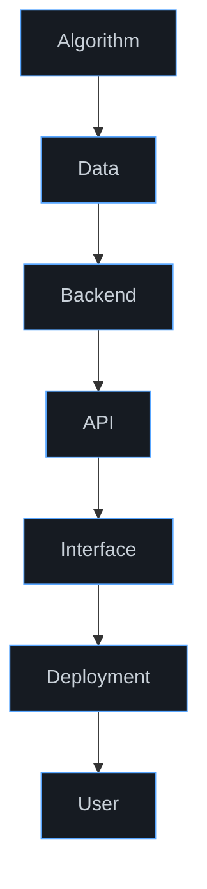
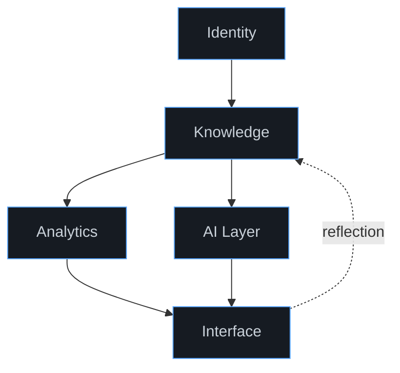

# Bhargava Vagathuri

<p align="center">
  
</p>

<p align="center">
  
</p>

<p align="center">
  
  
  
  
</p>

<p align="center"><strong>BHARGAVA.OS</strong><br /><sub>BUILD → BREAK → UNDERSTAND → REBUILD</sub></p>

---

## BOOT SEQUENCE

<p align="center">
  
</p>
## SYSTEM STATUS

| SYSTEM | STATE |
|:--|:--|
| Identity | Bhargava Vagathuri · Chennai, India |
| Current mode | B.Tech CSE student at Sai University |
| Status | Building, working from home |
| Focus | AI engineering · Web/full-stack · Data engineering · Security · 3D interfaces |

## ABOUT

I’m a B.Tech Computer Science student at Sai University interested in building and understanding systems across software, data, AI, security, and interactive 3D experiences.

I like following a problem through its layers: **Algorithm → Data → Backend → API → Interface → Deployment → User.**

## STACK LAYERS


```mermaid
flowchart TB
    A[Algorithm] --> B[Data]
    B --> C[Backend]
    C --> D[API]
    D --> E[Interface]
    E --> F[Deployment]
    F --> G[User]
    classDef node fill:#161b22,stroke:#58a6ff,color:#c9d1d9,stroke-width:1px
    class A,B,C,D,E,F,G node
```

## TECH STACK

<picture>
  <source media="(prefers-color-scheme: dark)" srcset="https://skillicons.dev/icons?i=c,python,js,html,css,react,threejs,nodejs,flask,postgres,mongodb,git,github&amp;theme=dark" />
  <source media="(prefers-color-scheme: light)" srcset="https://skillicons.dev/icons?i=c,python,js,html,css,react,threejs,nodejs,flask,postgres,mongodb,git,github&amp;theme=light" />
  
</picture>

**Languages:** C · Python · JavaScript · SQL  
**Web:** HTML · CSS · React · Three.js · Node.js · Flask · REST APIs  
**Data & AI:** PostgreSQL · MongoDB · Pandas · NumPy · Scikit-learn · Streamlit · Plotly  
**Tools:** Git · GitHub · Netlify · VS Code · Postman

## FEATURED PROJECTS

<table>
  <tbody>
    <tr>
      <td width="50%" valign="top">
        <strong>AI Engineering Intelligence</strong><br />
        GitHub repository analysis, feature extraction, and ML-based risk scoring surfaced in a Streamlit dashboard.<br />
        <sub>Python · GitHub API · PostgreSQL · Machine Learning · Streamlit</sub><br />
        <sub>Flow: GitHub API → Analyzer → Features → PostgreSQL → Risk score → Dashboard</sub><br />
        <sub>Repository: [ADD DATA: repository URL]</sub>
      </td>
      <td width="50%" valign="top">
        <strong>CartShare</strong><br />
        Collaborative shopping with cross-tab synchronization using localStorage and no backend.<br />
        <sub>Live demo: <a href="https://cartshareweb.netlify.app/">cartshareweb.netlify.app</a></sub><br />
        <sub>Repository: [ADD DATA: repository URL]</sub>
      </td>
    </tr>
    <tr>
      <td width="50%" valign="top">
        <strong>SVBG Labs</strong><br />
        Synaptic Vector Brain Grid: a personal knowledge graph with an AI reflection layer.<br />
        <sub>Repository: [ADD DATA: repository URL]</sub>
      </td>
      <td width="50%" valign="top">
        <strong>3D Automotive Experience</strong><br />
        React and Three.js experience with a scroll-driven camera and exploded view.<br />
        <sub>Repository: [ADD DATA: repository URL]</sub><br />
        <sub>Preview: [ADD DATA: recording or animated WebP]</sub>
      </td>
    </tr>
    <tr>
      <td width="50%" valign="top">
        <strong>Snake Arcade Remastered</strong><br />
        Canvas game loop with particles and a combo system.<br />
        <sub>Repository: [ADD DATA: repository URL]</sub>
      </td>
      <td width="50%" valign="top">
        <strong>More builds</strong><br />
        Bomb Defusal (Python) · MANTRA Travel Website · Video Streaming Platform.<br />
        <sub>Repositories: [ADD DATA: repository URLs]</sub>
      </td>
    </tr>
  </tbody>
</table>

<details>
  <summary>Project notes: problem, challenge, and current state</summary>

- **AI Engineering Intelligence** — Problem: make repository engineering signals easier to inspect. Challenge: turn repository data into useful features and a risk score. Current state: [ADD DATA: current state and repository URL].
- **CartShare** — Problem: share a shopping list across browser tabs without a backend. Challenge: keep tab state synchronized with localStorage. Current state: live demo available; [ADD DATA: repository URL].
- **SVBG Labs** — Problem: connect personal knowledge with reflection. Challenge: [ADD DATA: implementation challenge]. Current state: [ADD DATA: current state and repository URL].
- **3D Automotive Experience** — Problem: [ADD DATA: experience goal]. Challenge: coordinate scroll position, camera movement, and an exploded view. Current state: [ADD DATA: current state, repository URL, and preview].
- **Snake Arcade Remastered** — Problem: [ADD DATA: game goal]. Challenge: combine a Canvas loop, particles, and combo behavior. Current state: [ADD DATA: current state and repository URL].
- **Bomb Defusal, MANTRA Travel Website, Video Streaming Platform** — [ADD DATA: concise problem, challenge, current state, and repository URLs].
</details>

## SVBG LABS — KNOWLEDGE GRAPH

A conceptual map of the SVBG Labs idea: identity informs knowledge, knowledge feeds analytics and an AI reflection layer, and the interface brings those pieces together.


```mermaid
flowchart TB
    I[Identity] --> K[Knowledge]
    K --> A[Analytics]
    K --> AI[AI Layer]
    A --> UI[Interface]
    AI --> UI
    UI -. reflection .-> K
    classDef node fill:#161b22,stroke:#58a6ff,color:#c9d1d9,stroke-width:1px
    class I,K,A,AI,UI node
```

## 3D INTERFACES

The 3D Automotive Experience explores a scroll-driven camera and an exploded view with React and Three.js.

**Preview placeholder:** [ADD DATA: link or embed-ready recording/animated WebP]. Add the real preview when it is available.

## ARCHITECTURE LAB

Illustrative architecture patterns for a web app, AI app, and data pipeline.


```mermaid
%%{init: {"theme":"dark","themeVariables":{"primaryColor":"#161b22","primaryTextColor":"#c9d1d9","primaryBorderColor":"#58a6ff","lineColor":"#39d0d8","secondaryColor":"#0d1117","tertiaryColor":"#1f6feb"}}}%%
flowchart TB
    subgraph WEB["WEB APP"]
      U[User] --> UI[React interface]
      UI --> API[REST API]
      API --> DB[(PostgreSQL or MongoDB)]
    end
    subgraph AI["AI APP"]
      R[Repository] --> ING[Ingestion and features]
      ING --> MODEL[Model or scoring logic]
      MODEL --> DASH[Streamlit dashboard]
    end
    subgraph DATA["DATA PIPELINE"]
      SRC[Source data] --> TRANSFORM[Transform and validate]
      TRANSFORM --> STORE[(Database)]
      STORE --> REPORT[Analysis or visualization]
    end
```

## ROADMAP

**Foundation → Systems → Intelligence → Security → Advanced**

Learning directions, not claims of expertise.

## GITHUB ANALYTICS

<picture>
  <source media="(prefers-color-scheme: dark)" srcset="https://github-readme-stats.vercel.app/api?username=vbhargava0203-glitch&amp;show_icons=true&amp;hide_border=true&amp;bg_color=0d1117&amp;title_color=58a6ff&amp;text_color=c9d1d9&amp;icon_color=39d0d8" />
  <source media="(prefers-color-scheme: light)" srcset="https://github-readme-stats.vercel.app/api?username=vbhargava0203-glitch&amp;show_icons=true&amp;hide_border=true&amp;bg_color=ffffff&amp;title_color=0969da&amp;text_color=24292f&amp;icon_color=0969da" />
  
</picture>

<picture>
  <source media="(prefers-color-scheme: dark)" srcset="https://github-readme-stats.vercel.app/api/top-langs/?username=vbhargava0203-glitch&amp;layout=compact&amp;hide_border=true&amp;bg_color=0d1117&amp;title_color=58a6ff&amp;text_color=c9d1d9" />
  <source media="(prefers-color-scheme: light)" srcset="https://github-readme-stats.vercel.app/api/top-langs/?username=vbhargava0203-glitch&amp;layout=compact&amp;hide_border=true&amp;bg_color=ffffff&amp;title_color=0969da&amp;text_color=24292f" />
  
</picture>

<picture>
  <source media="(prefers-color-scheme: dark)" srcset="https://streak-stats.demolab.com?user=vbhargava0203-glitch&amp;theme=github-dark-blue&amp;hide_border=true&amp;background=0D1117&amp;ring=58A6FF&amp;fire=39D0D8&amp;currStreakLabel=C9D1D9" />
  <source media="(prefers-color-scheme: light)" srcset="https://streak-stats.demolab.com?user=vbhargava0203-glitch&amp;theme=default&amp;hide_border=true&amp;background=ffffff&amp;ring=0969da&amp;fire=bf8700&amp;currStreakLabel=24292f" />
  
</picture>

<picture>
  <source media="(prefers-color-scheme: dark)" srcset="https://github-readme-activity-graph.vercel.app/graph?username=vbhargava0203-glitch&amp;bg_color=0d1117&amp;color=c9d1d9&amp;line=58a6ff&amp;point=39d0d8&amp;area=true&amp;hide_border=true" />
  <source media="(prefers-color-scheme: light)" srcset="https://github-readme-activity-graph.vercel.app/graph?username=vbhargava0203-glitch&amp;bg_color=ffffff&amp;color=24292f&amp;line=0969da&amp;point=bf8700&amp;area=true&amp;hide_border=true" />
  
</picture>

<picture>
  <source media="(prefers-color-scheme: dark)" srcset="https://raw.githubusercontent.com/vbhargava0203-glitch/vbhargava0203-glitch/output/github-contribution-grid-snake-dark.svg" />
  <source media="(prefers-color-scheme: light)" srcset="https://raw.githubusercontent.com/vbhargava0203-glitch/vbhargava0203-glitch/output/github-contribution-grid-snake.svg" />
  
</picture>

## OPEN SOURCE & CONTACT

Interested in collaborating on thoughtful software, AI, data, security, and interactive experiences.

```text
$ whoami
Bhargava Vagathuri

$ status
Open to collaborate

$ links
GitHub    https://github.com/vbhargava0203-glitch
LinkedIn  https://www.linkedin.com/in/bhargava-vagathuri202529/
Portfolio https://bhargavavagathuri.netlify.app/
Email     [ADD DATA: email address]
```

<p align="center">
  <a href="https://github.com/vbhargava0203-glitch"></a>
  <a href="https://www.linkedin.com/in/bhargava-vagathuri202529/"></a>
  <a href="https://bhargavavagathuri.netlify.app/"></a>
</p>

<p align="center">
  
</p>

<p align="center">
  
</p>

<details>
  <summary>README design notes and setup checklist</summary>

### Design rationale

- The graphite, blue, violet, and cyan palette carries the BHARGAVA.OS terminal and engineering-blueprint theme.
- Hosted images provide the hero motion and live GitHub cards; Mermaid keeps architecture diagrams readable as text and on narrow screens.
- `<picture>` selects dark or light versions where the image service supports both, and descriptive alt text preserves context when images do not load.
- No JavaScript, CSS, script, iframe, local asset, or invented metric is required by this README.
- The layout uses fluid image widths and stacks its main content vertically for narrow screens.

### Manual setup

- [ ] Save this as `README.md` in the `vbhargava0203-glitch/vbhargava0203-glitch` profile repository.
- [ ] Replace the clearly marked [ADD DATA] placeholders with repository URLs, project status details, the 3D preview, and email address.
- [ ] To enable the contribution snake, copy the YAML below into `.github/workflows/snake.yml` in that repository, enable GitHub Actions, then run the workflow once. A single README cannot execute a GitHub Actions workflow; the complete source is included here for convenience.
- [ ] Confirm the repository’s Actions settings permit the workflow to write to the `output` branch. The workflow grants `contents: write` to its token.
- [ ] External animation, icon, and statistics images depend on their hosted services being available.

### Contribution snake workflow

```yaml
name: Generate contribution snake

on:
  schedule:
    - cron: "17 2 * * *"
  workflow_dispatch:
  push:
    branches:
      - main

permissions:
  contents: write

jobs:
  generate:
    runs-on: ubuntu-latest
    timeout-minutes: 10
    steps:
      - name: Generate light and dark SVGs
        uses: Platane/snk/svg-only@v3
        with:
          github_user_name: vbhargava0203-glitch
          outputs: |
            dist/github-contribution-grid-snake.svg?palette=github-light
            dist/github-contribution-grid-snake-dark.svg?palette=github-dark
      - name: Publish SVGs to the output branch
        uses: crazy-max/ghaction-github-pages@v5
        with:
          target_branch: output
          build_dir: dist
        env:
          GITHUB_TOKEN: ${{ secrets.GITHUB_TOKEN }}
```

</details>


